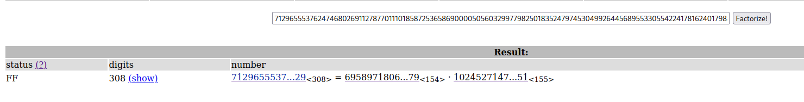
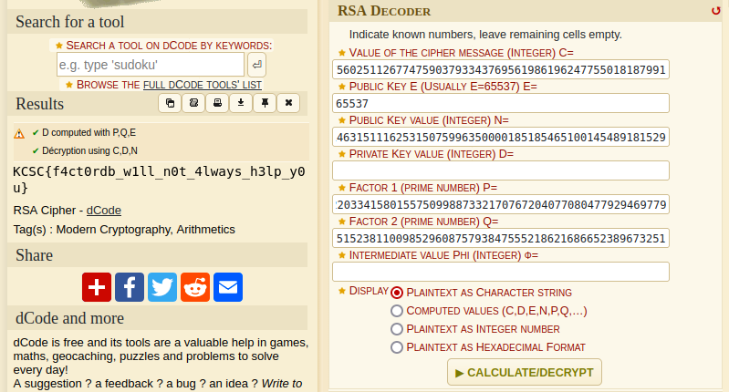

Here we have yet another RSA problem, but the difference from the challenge "What the RSA?", is that we do not have the prime number factors of N. Our provided N is fairly large, which is on purpose, since one of the properties of RSA encryption is to make factorising N implausible. Given that, and the fact we have to factorize it, means there is probably a database out there that has already done so.

[Factordb](http://factordb.com) (non encrypted website) is such a database, and if we search for our N we will find that it indeed does have a recorded factorization.

Plugging the P and Q into [dcode](https://dcode.fr), it will calculate the private key d and subsequently decrypt our cipher.

We could alternatively have skipped the factordb part, as dcode actually uses that database for its calculator. There was also a python script included that was intended to be modified, but I found it much easier to just plug the numbers into dcode.
