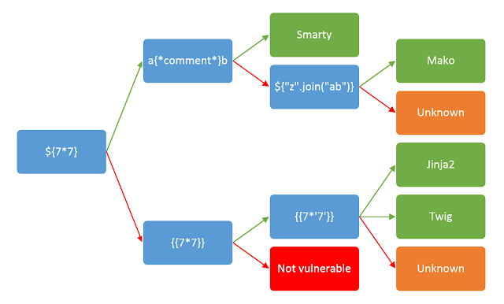
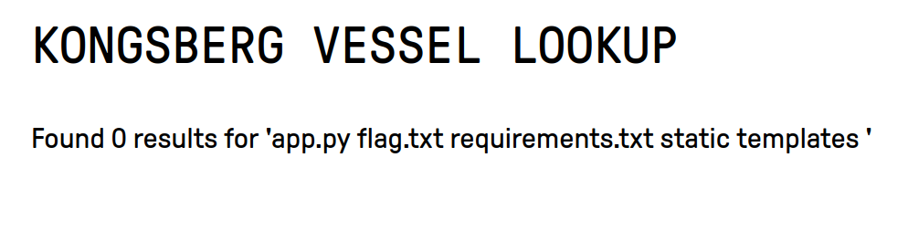
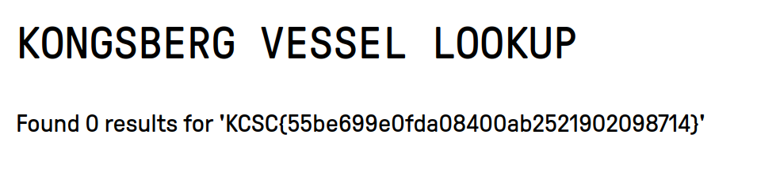

In this challenge we have a web service where you can look up ocean vessels by their IMO number. Kongsberg are known to have a huge maritime sector, but given that the challenge hints at injection vulnerabilities, I assumed boats would have nothing to do with it. I first attempted to submit the classic `1 = 1 --` SQL injection vulnerabilty, without any interesting results.

After a hint from the organisers, I was pointed in the right direction of search, which was SSTI (Server Side Template Injection). In short, template engines take in data and combine it with a predefined template to create a web page. They are vulnerable to code injection attacks just as with SQL, if the input data is not properly sanitised. 

Part of the challenge here was to detect what kind of server side application was running and taking our inputs, so that we could attempt known exploits. [Hacktricks](https://book.hacktricks.xyz/pentesting-web/ssti-server-side-template-injection) provides a thorough guide to investigate which server is running in the background and has a number of known exploits for each. 

This diagram from [Hacktricks](https://book.hacktricks.xyz/pentesting-web/ssti-server-side-template-injection) shows different inputs to feed the server to conclude what application might be running. The green path is to be followed if the command was executed, and the red for when not.



Sending in `${7*7}` does not result in anything, however the second block following the red path results in the code being executed and showing the result of `7*7` being 49. Following the green path, the next block thereafter is also executed by the server, giving the result of "7777777". Thus we have narrowed the server side application down to being either Twig or Jinja2. 

The twig exploits listed on hacktricks gave me no result, so I attempted all the Jinja2 ones i could find. The following code: ```{{config.__class__.from_envvar.__globals__.import_string("os").popen("ls").read()}}```
executes the command written in the parenthesis after `.popen`. `ls` lists all files in the current working directory, and running it I can see theres a file called "flag.txt":



I send the same command again, this time replacing `ls` with `cat flag.txt`, and it shows me the flag:



While this might look like a md5 hash of a string, it is actually the complete flag.
