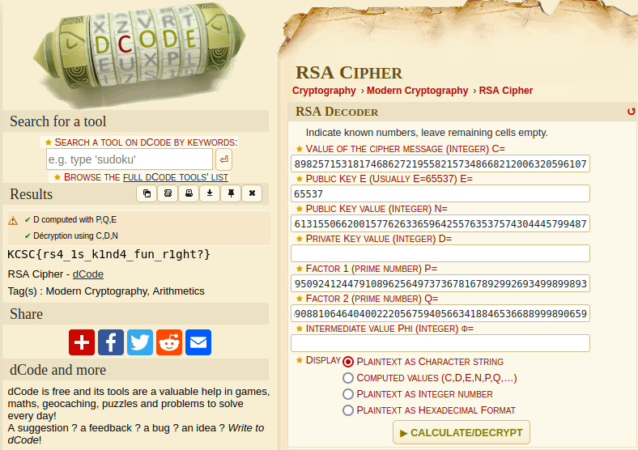

In this challenge we are presented with a cipher and the components comprising an RSA encryption key. We are missing the private key exponent that would let us decrypt the cipher. Luckily we have all we need to calculate it, including a python script to do it all for us! However, I already happened to have the online calculator [dcode](https://dcode.fr) open and ready, so I just plugged all the numbers in and it calculates the private exponent d, and uses it to decrypt the message.

